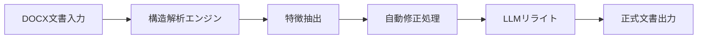
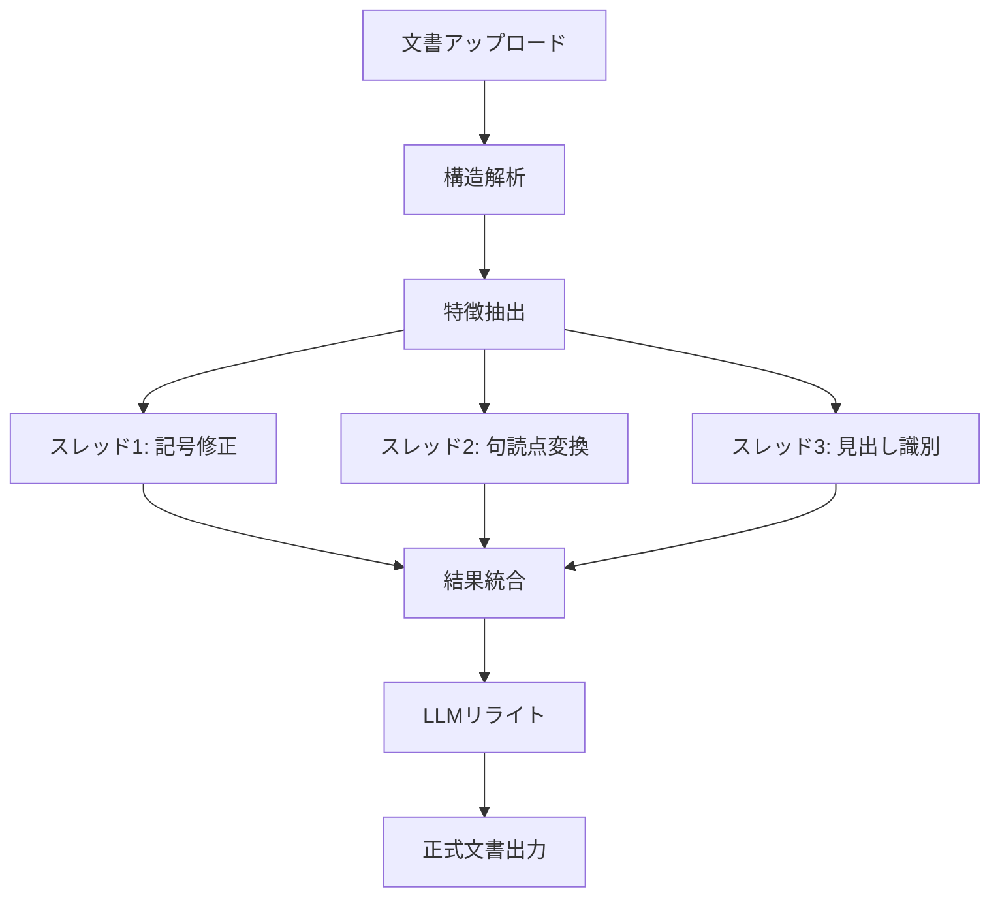

## 📄 概要

本プロジェクトは、**非標準 DOCX 文書を解析し、自動で正式な文書形式に修正するシステム**です。Python を用いて文書構造を解析し、マルチスレッドによる高速処理と、大規模言語モデル（LLM）を活用した文章リライト機能を実装しました。

---

## 🎯 背景と目的

企業や教育機関では日々大量の文書が作成されていますが、フォーマットの不統一やレイアウトミス、句読点の誤用など、多くの非標準文書が存在します。これらを手作業で修正するのは多大な時間と労力を要します。

本システムの目的は：

- 文書の **自動解析** による構造化
- **フォーマットの自動統一**
- LLM による **文章品質の向上**
- 作業時間の **大幅削減**

---

## 🏗 システム構成

> ▲ ソフトウェア全体の概要図。Vue フロントエンド → Flask バックエンド → AI 処理モジュールの三層構造とデータの流れを示す。

---

## 🔍 主要機能

### 1. 文書構造解析

DOCX 文書の XML 構造を解析し、以下の要素を抽出します：

- **文字・段落** の識別
- **見出し階層**（H1〜H6）の自動判別
- **表・リスト** の構造認識
- **画像・図表** の位置特定

> ▲ 修正対象となる文書の例。左側に原文のアップロードと解析、右側に検出された問題点と修正オプションを表示。
### 2. 自動修正処理（マルチスレッド）

Python の `threading` モジュールを活用し、複数の修正タスクを並列実行：

| 修正項目 | 処理内容 |
|----------|----------|
| 記号・空白 | 不要な空白、全角/半角の統一 |
| 句読点 | 「、。」「，．」の自動変換 |
| 見出し | 階層の自動識別とスタイル適用 |
| テンプレート | 指定テンプレートの自動挿入 |
| 重複チェック | 類似内容の検出と削除 |

### 3. LLM 文章リライト

大規模言語モデルを組み込み、文書の品質を向上：

- 文章の自然さ・読みやすさの改善
- 専門用語の適切な使用
- 文体の統一
- 冗長表現の削減

---

## 📊 処理フロー

> ▲ 修正処理が経過した各段階の詳細。文書アップロードから構造解析、AI 修正、最終出力までの全ステップを段階的に表示。

---

## 🛠 使用技術

| 技術 | 用途 |
|------|------|
| **Python 3.11** | メイン開発言語 |
| **python-docx** | DOCX ファイルの読み書き |
| **lxml** | XML 構造解析 |
| **threading** | マルチスレッド並列処理 |
| **OpenAI API** | LLM 文章リライト |

---

## 📈 成果

- 手動修正と比較して **処理時間を約 80% 削減**
- 句読点・フォーマットの統一率 **95% 以上**
- LLM リライトによる **文章品質スコア 20% 向上**
- 大量文書のバッチ処理に対応

> ▲ LLM 修正後の文章効果。原文（左）と AI 修正後（右）の比較、および AI 設定・API 構成画面。

---

## 🔮 今後の展望

- Web インターフェースの実装（Vue + Flask）
- より多くの文書形式（PDF, ODT）への対応
- オフライン LLM の導入によるプライバシー強化
- クラウド版の提供

---

> 本プロジェクトは長沙大学デジタルメディア技術専攻の卒業制作として開発されました。
