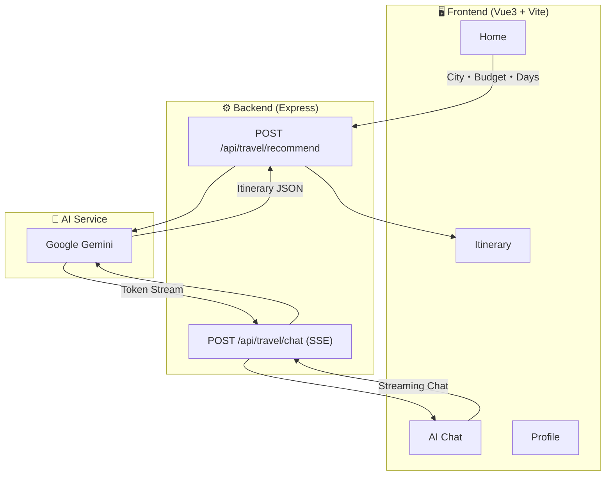

## 📄 Overview

**AI Travel Assistant** is a **Japanese travel planning web app** powered by Google Gemini. Just enter your destination, budget, and number of days — AI generates a detailed itinerary automatically. Includes real-time streaming AI chat.

> 🌐 **Live Site:** [https://travel-app-02ok.onrender.com/](https://travel-app-02ok.onrender.com/)

---

## 🎯 Why I Built This

Planning a trip involves researching attractions, food, and accommodations — very time-consuming. Language barriers make it even harder for international travel.

So I built this app to use AI to **generate an ideal travel plan in seconds**.

---

## 🏗 Architecture

> ▲ Simple input form. One-tap selection for popular destinations: Tokyo, Osaka, Kyoto, Sapporo.

---

### AI Chat

Real-time conversation with AI assistant via SSE — **token-by-token streaming display**.

> ▲ Suggested questions help newcomers get started easily.

---

### Travel Itinerary

Generated plans organized by **day & time slot (morning/afternoon/evening)**, with budget breakdown.

> ▲ Collapsible panels for clean viewing. Budget and tips at a glance.

---

## 🛠 Tech Stack

| Category | Technology |
|----------|-----------|
| **Frontend** | Vue 3, Vite, Vant 4 |
| **Backend** | Node.js, Express |
| **AI/LLM** | Google Gemini (`@google/genai` SDK) |
| **Streaming** | Server-Sent Events (SSE) |
| **Language** | Japanese UI |

---

## 🔍 Technical Highlights

### Real-time AI Chat via SSE

Unlike traditional API calls, SSE delivers AI-generated text **token by token in real-time**.

### Structured Prompts for Stable JSON

Sends Gemini a **strict JSON Schema** prompt to ensure consistent structured output.

### Mobile-First UI

Built with Vant 4 for smartphone-first design. Bottom tab bar, picker, collapsible panels — all **optimized for mobile users**.

---

> 🌐 **Live Site:** [https://travel-app-02ok.onrender.com/](https://travel-app-02ok.onrender.com/)
>
> Personal project. Source code coming soon.
