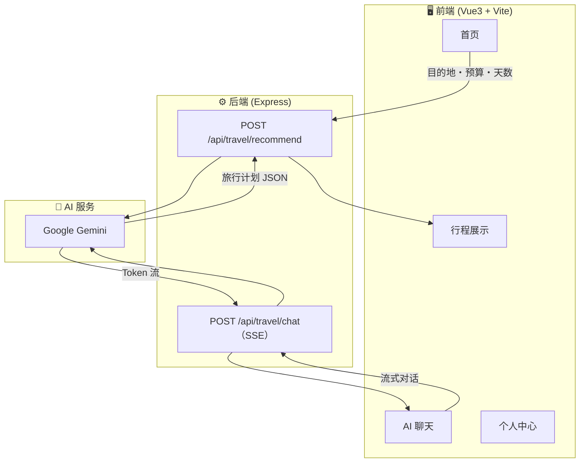

## 📄 概述

**AI 旅行助手**是一款基于 Google Gemini 大语言模型的**日语旅行规划 Web 应用**。只需输入目的地、预算和天数，AI 就能自动生成详细的旅行计划。同时还搭载了 AI 实时流式聊天功能。

> 🌐 **公开URL:** [https://travel-app-02ok.onrender.com/](https://travel-app-02ok.onrender.com/)

---

## 🎯 开发动机

规划旅行时，调查景点、美食和住宿需要花费大量时间。尤其是海外旅行还面临语言障碍，高效规划变得困难。

因此开发了这款借助 AI 力量**数秒内生成理想旅行计划**的应用。

---

## 🏗 系统架构

> ▲ 简洁的输入表单。东京・大阪・京都・札幌等热门目的地一键选择。

---

### AI 聊天

与 AI 助手实时对话，获取旅行建议。通过 Server-Sent Events（SSE）实现**逐字流式显示**。

> ▲ 预设推荐问题，聊天新手也能轻松上手。

---

### 旅行计划

生成的旅行计划按**天・时段（上午/下午/晚上）**整理，预算明细和旅行提示一目了然。

> ▲ 折叠面板清晰展示。预算分配和注意事项一览无余。

---

## 🛠 技术栈

| 类别 | 技术 |
|------|------|
| **前端** | Vue 3、Vite、Vant 4 |
| **后端** | Node.js、Express |
| **AI / LLM** | Google Gemini（`@google/genai` SDK） |
| **流式传输** | Server-Sent Events (SSE) |
| **语言** | 日语 UI |

---

## 🔍 技术亮点

### SSE 实时 AI 对话

相比传统 API 需要等待完整响应，SSE 能**逐 Token 实时显示** AI 生成的内容。

### 结构化 Prompt 保证稳定 JSON 输出

向 Gemini 发送**严格 JSON Schema** 的 Prompt，确保获得稳定的结构化数据。

### 移动端优先 UI

采用 Vant 4，以手机使用为前提设计。底部标签栏、Picker 选择器、折叠面板等，**为移动用户优化**。

---

> 🌐 **公开URL:** [https://travel-app-02ok.onrender.com/](https://travel-app-02ok.onrender.com/)
>
> 本项目为个人开发作品。
