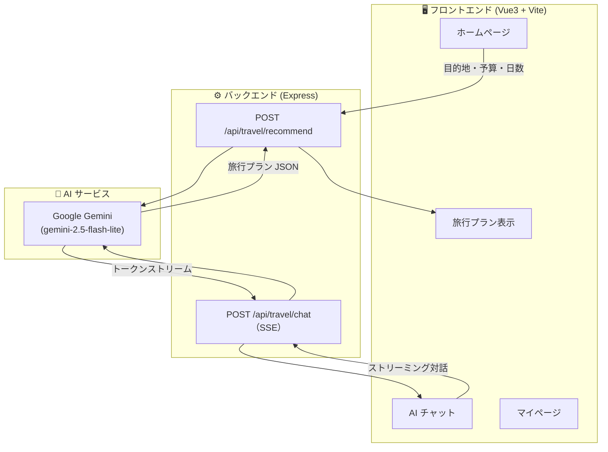

## 📄 概要

**AI 旅行アシスタント**は、Google Gemini 大規模言語モデルを活用した**日本語旅行プランニング Web アプリ**です。目的地・予算・日数を入力するだけで、AI が自動的に詳細な旅行計画を生成します。さらに、AI とのリアルタイムストリーミングチャット機能も搭載しています。

---

## 🎯 なぜ作ったのか

旅行の計画を立てるとき、行き先の観光スポットやグルメ、宿泊先の調査には膨大な時間がかかります。特に海外旅行では言語の壁もあり、効率的なプランニングが難しいのが現状です。

そこで、AI の力を借りて**数秒で理想の旅行プラン**を作成できるアプリを開発しました。

---

## 🏗 システム構成



---

## 🎨 画面紹介

### ホームページ

旅行プランの入力画面です。目的地を選択し、予算と日数を入力して「プランを開始」ボタンを押すだけ。


> ▲ シンプルな入力フォーム。東京・大阪・京都・札幌などの人気目的地をワンタップで選択可能。

---

### AI チャット

旅行に関する質問を AI アシスタントとリアルタイムで会話できます。Server-Sent Events（SSE）による**トークン単位のストリーミング表示**で、まるで人間とチャットしているような体験を実現。


> ▲ よくある質問の候補も表示され、チャット未経験でも気軽に使い始められる。

---

### 旅行プラン結果

生成された旅行プランは**日別・時間帯別（午前/午後/夜）**に整理され、予算の内訳や旅行のヒントも表示されます。


> ▲ 折りたたみパネルで見やすく整理。予算配分や注意点も一目で確認できる。

---

## 🛠 技術スタック

| カテゴリ | 技術 |
|----------|------|
| **フロントエンド** | Vue 3、Vite、Vant 4（モバイルUI） |
| **バックエンド** | Node.js、Express |
| **AI / LLM** | Google Gemini（`@google/genai` SDK） |
| **ストリーミング** | Server-Sent Events (SSE) |
| **HTTP** | Axios + Fetch API |
| **言語** | 日本語 UI |

---

## 🔍 技術のポイント

### 1. SSE によるリアルタイム AI 対話

通常の API 呼び出しではレスポンスが完了するまで待つ必要がありますが、SSE（Server-Sent Events）を使うことで、AI が生成したテキストを**1トークンずつリアルタイムに表示**できます。

```javascript
// フロントエンド側のストリーム受信
async function fetchStream(url, body, onChunk) {
  const res = await fetch(url, {
    method: 'POST',
    headers: { 'Content-Type': 'application/json' },
    body: JSON.stringify(body)
  });
  const reader = res.body.getReader();
  const decoder = new TextDecoder();
  let buffer = '';
  while (true) {
    const { done, value } = await reader.read();
    if (done) break;
    buffer += decoder.decode(value, { stream: true });
    // SSE data 行を解析して onChunk に渡す
    const lines = buffer.split('\n');
    buffer = lines.pop();
    for (const line of lines) {
      if (line.startsWith('data: ')) {
        const data = JSON.parse(line.slice(6));
        onChunk(data);
      }
    }
  }
}
```

### 2. 構造化プロンプトによる安定した JSON 出力

旅行プラン生成では、Gemini に**厳密な JSON スキーマ**を指定したプロンプトを送り、安定した構造化データを取得しています。

```javascript
const prompt = `
あなたはプロの旅行プランナーです。
以下の条件で${days}日間の${city}旅行プランを作成してください。

予算: ${budget}円

以下のJSON形式で厳密に出力してください:
{
  "dailyItinerary": [
    {
      "day": 1,
      "morning": "午前のアクティビティ",
      "afternoon": "午後のアクティビティ",
      "evening": "夜のアクティビティ"
    }
  ],
  "budgetBreakdown": { "交通費": 0, "宿泊費": 0, "食費": 0, "観光費": 0 },
  "tips": ["ヒント1", "ヒント2"],
  "warnings": ["注意点1"]
}
`;
```

### 3. モバイルファースト UI

Vant 4 を採用し、スマートフォンでの利用を前提とした UI 設計。ボトムタブバーによる直感的な画面切り替え、Picker による簡単な目的地選択、折りたたみパネルによる情報の整理など、**モバイルユーザーに最適化**された体験を提供します。

---

## 📱 対応デバイス

スマートフォンでの利用を主なターゲットとして設計。Vant のモバイル UI コンポーネントにより、ネイティブアプリのような操作感を実現しています。

---

## 🔮 今後の展望

- 複数都市を巡る**周遊プラン**の生成
- ユーザーの**好み（グルメ重視・観光重視など）**に応じたカスタマイズ
- **宿泊施設・交通機関の予約リンク**の自動挿入
- オフライン LLM の導入による応答速度の向上
- PWA 化によるネイティブアプリ化

---

> 本プロジェクトは個人開発作品です。ソースコードは GitHub で公開予定。
